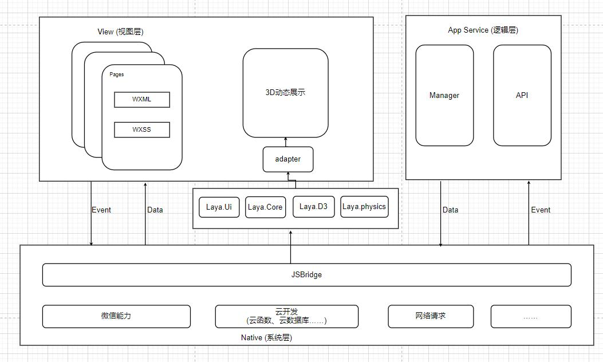
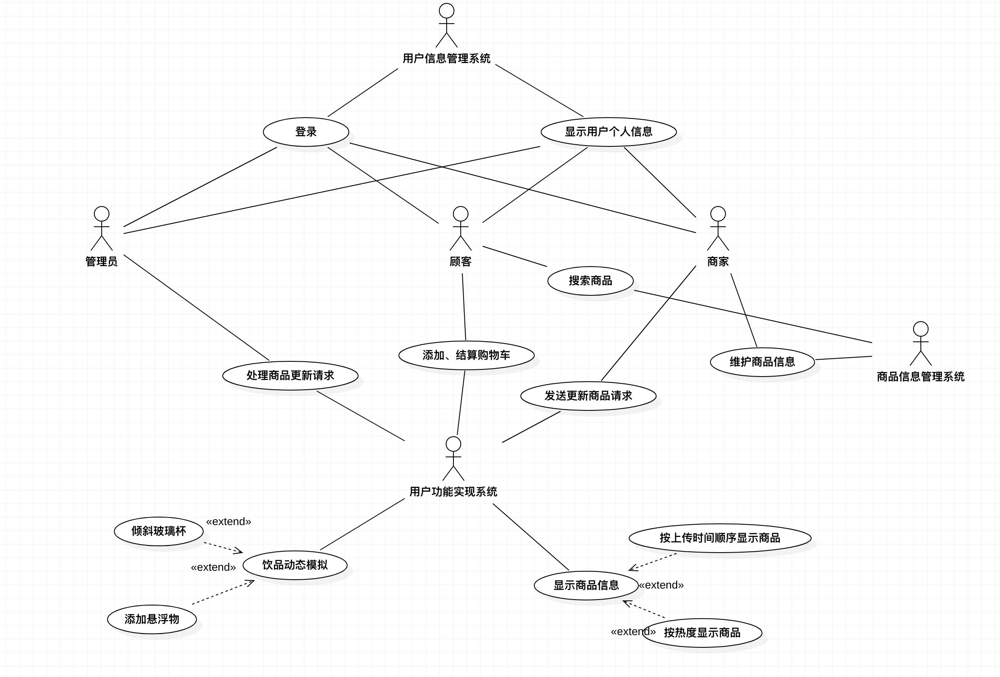
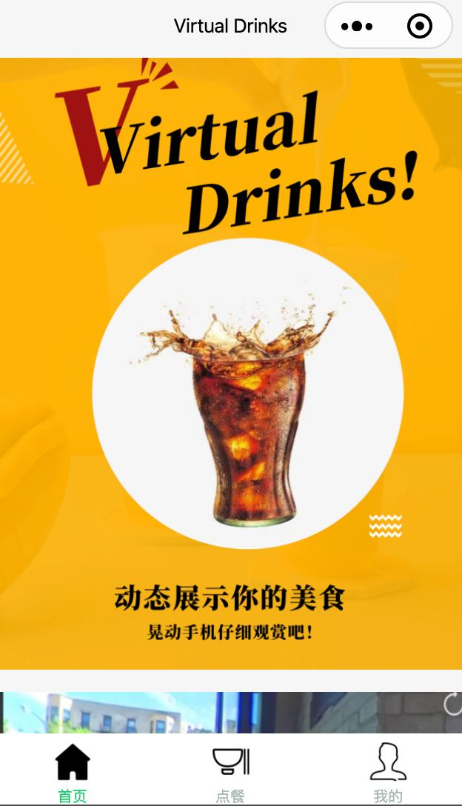
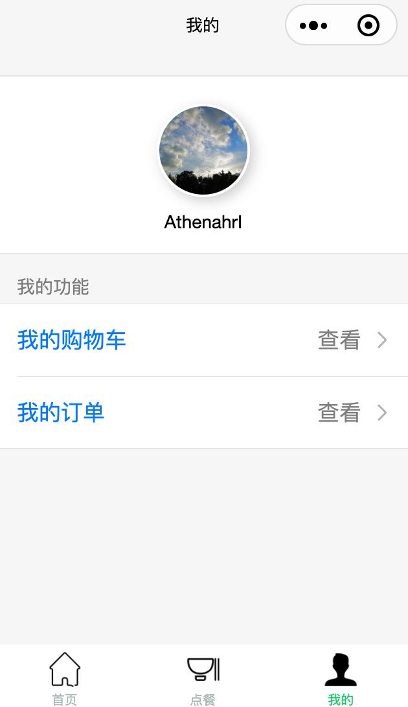
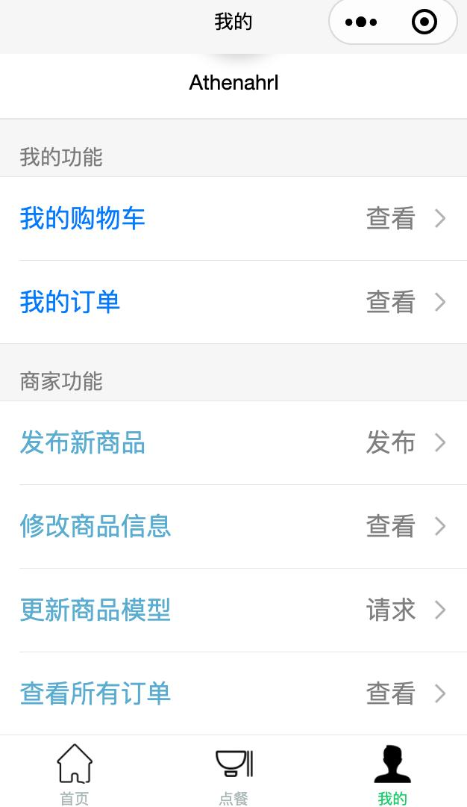
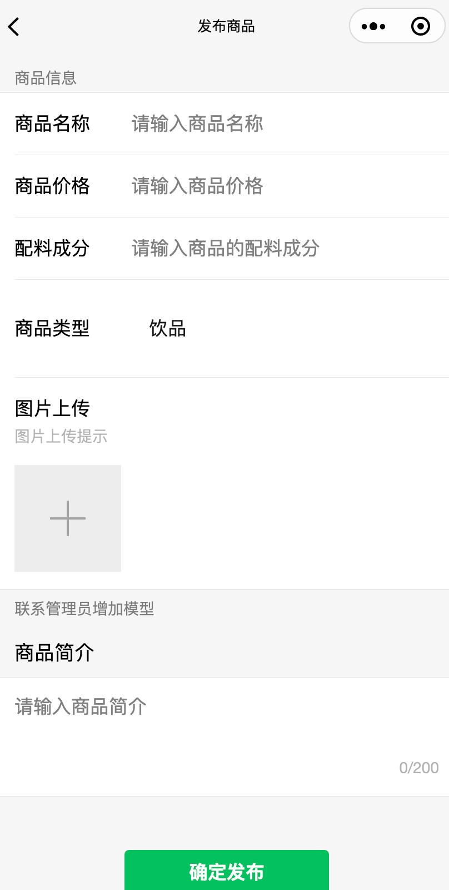
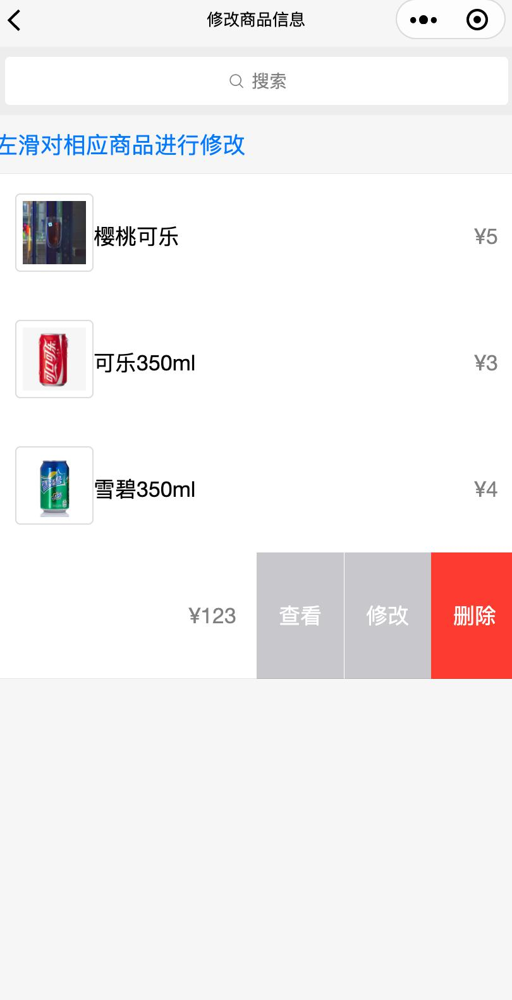
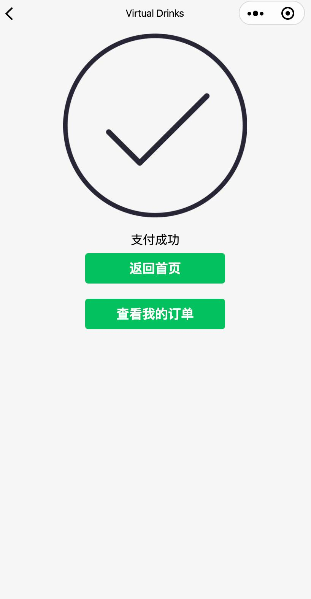

# VirtualDrinks_WX

该项目为同济大学软件工程2020年软件工程课程设计项目

VirtualDrinks是一款基于3D 模型展示的云开发点餐小程序，旨在通过和商家的合作，改善顾客的餐前体验。让顾客可以在漫长的餐前等待中，通过访问和使用小程序，看看餐厅准备的食物和饮品，仿佛触手可及，一缓眼前的疲劳，重新续上等待的耐心。

## 系统架构

视图层负责渲染页面结构，逻辑层负责逻辑处理、数据请求、接口调用等。视图层和逻辑层分离，通过数据驱动，事件交互。视图层与逻辑层通过数据和事件进行通信，逻辑层提供数据给视图层，视图层通过绑定/捕获事件发起交互让逻辑层处理JSBridge下架起上层开发与Native（系统层）的桥梁，使得小程序可通过API使用原生的功能，部分组件为原生组件实现，从而有良好体验。实现了对底层API接口的调用，所以在小程序里面开发，开发者不用太多去考虑OS实现差异的问题，安心在上层的视图层和逻辑层进行开发即可。

更多系统架构设计、模块设计、类设计、接口设计以及界面设计的内容，请下载[SDS.pdf](SDS.pdf)

## 需求分析用例图

更多用例图、类图、活动图、时序图及需求分析部分请下载[Requirement analysis.pdf](Requirement analysis.pdf)

## 数据库E-R图

更多数据库图、表信息请下载[SDS.pdf](SDS.pdf)

## 原型展示

|  |   |  |
| --------------------- | ---------------------- | ---------------------- |
|  |  |    |

